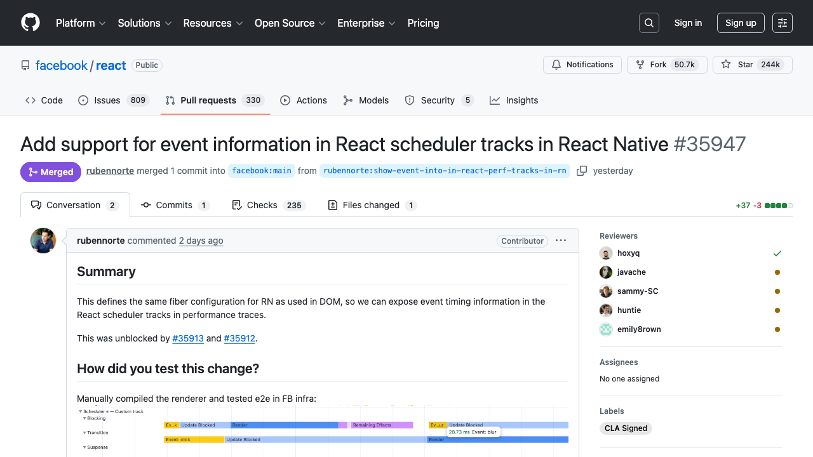
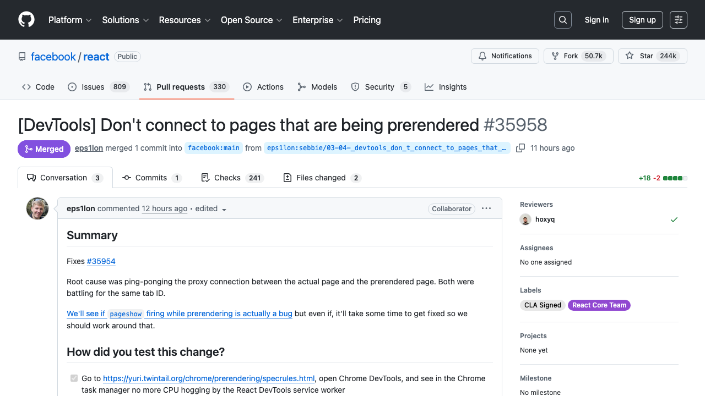
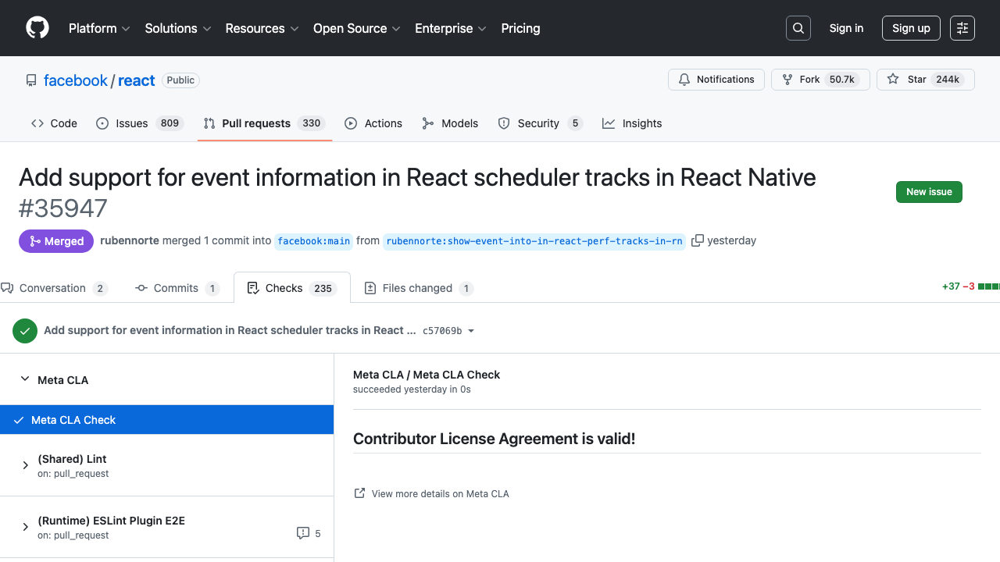
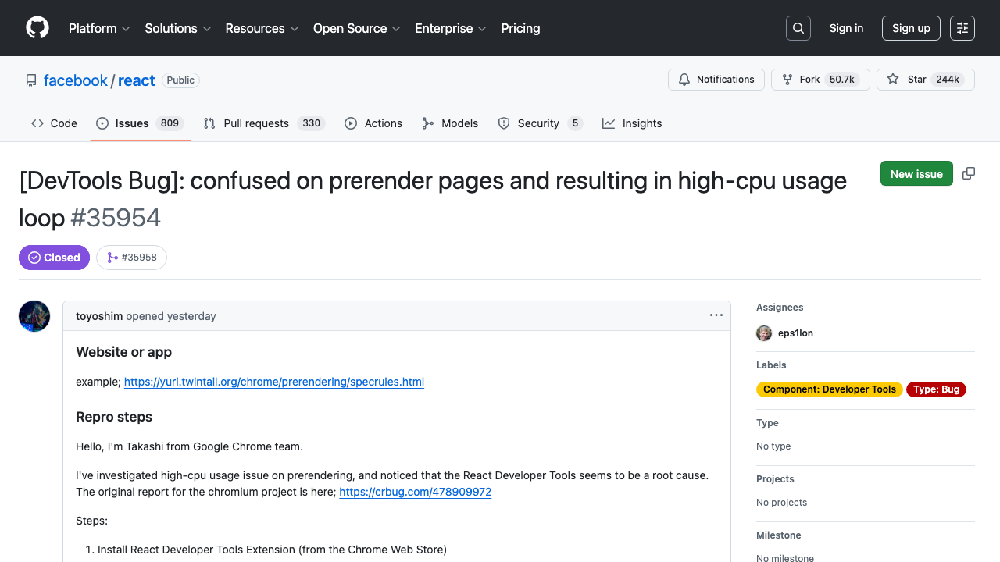

# GitHub Checks Playbook — Auditor Walkthrough

This document walks through how an auditor uses the `github-checks` playbook to collect evidence from GitHub pull requests. It covers input preparation, running the tool, what happens under the hood at each step, and interpreting the output.

---

## What This Playbook Collects

For each GitHub PR or commit URL, the tool automatically:

1. Opens the PR page and takes a screenshot
2. Extracts PR metadata (title, author, merge status, reviewers, merger)
3. Navigates to the Checks tab and takes a screenshot
4. Extracts all CI check results (pass/fail/pending counts)
5. For any failed checks, follows the CI details link and screenshots the logs
6. Finds linked Jira/Linear/GitHub issue tickets in the PR description
7. If a linked ticket is found, navigates to it and takes a screenshot

All evidence is saved to a structured output directory with screenshots, a results CSV, and per-sample audit trail files.

---

## Step 1: Prepare the Input CSV

Create a CSV file with a `pr_url` column containing the GitHub PR URLs to audit.

**Example** (`github_checks_demo.csv`):

```csv
pr_url
https://github.com/facebook/react/pull/35958
https://github.com/facebook/react/pull/35953
https://github.com/facebook/react/pull/35947
```

The tool also accepts `commit_url`, `repo_url`+`sha`, or `github_url` columns. Only `pr_url` is needed for standard PR evidence collection.

---

## Step 2: Run the Playbook

```bash
PYTHONPATH=src python -m evidence_collector.cli run github-checks \
  --input tests/manual/github_checks_demo.csv \
  --out out/demo_github_checks
```

### CLI Options

| Flag | Default | Description |
|------|---------|-------------|
| `--input` / `-i` | *(required)* | Path to input CSV file |
| `--out` / `-o` | `out` | Output directory |
| `--headless` / `--headful` | `--headless` | Show/hide browser window |
| `--max-per-minute` | `20` | Rate limit (pages/min) |
| `--profile` | *(none)* | Browser profile for authenticated sessions |

Use `--headful` during initial setup to watch the browser navigate and verify it's working correctly. Use `--profile` to point at a browser profile with saved GitHub login cookies for private repos.

---

## Step 3: What Happens Under the Hood

Each PR goes through a 7-step pipeline. The tool records which steps completed in a `notes.json` file after each step, enabling **crash-safe resumability** — if the run is interrupted, re-running the same command skips already-completed samples.

### Pipeline Steps

#### Step 1: `open_primary_page`

The tool launches a headless Chromium browser via Playwright and navigates to the PR URL. It waits for `networkidle` to ensure the page has fully loaded (GitHub is a React SPA that hydrates after initial HTML load).

If the page redirects to a login page, the sample is marked `AUTH_REQUIRED`. If a 404 is detected, it's marked `PAGE_NOT_FOUND`.

#### Step 2: `screenshot_pr_page`

A full-page screenshot is captured of the PR conversation view, showing the title, description, merge status badge, reviewers, and timeline.

**Example — merged PR:**



**Example — open PR:**



#### Step 3: `extract_metadata`

The tool extracts structured data from the PR page DOM:

| Field | Extraction Strategy |
|-------|-------------------|
| **title** | `bdi.js-issue-title`, then `h1.gh-header-title`, then page `<title>` tag |
| **pr_or_commit_id** | Parsed from the URL path (`/pull/35947` -> `35947`) |
| **merge_status** | `.State` badge element class (`State--merged`, `State--open`, `State--closed`) |
| **pr_creator** | `.gh-header-meta .author` link, fallback to first `a.author`, fallback to body text pattern `"X wants to merge"` |
| **approvers** | Sidebar `a.assignee` links in `#partial-discussion-sidebar` |
| **merger** | Timeline text matching `"X merged commit"` pattern |

Each extraction uses a primary selector with multiple fallback strategies, ensuring resilience against GitHub DOM changes.

#### Step 4: `screenshot_checks`

The tool navigates to the PR's Checks tab (`/pull/N/checks`) and takes a screenshot showing the CI check results sidebar.

**Example — checks page:**



#### Step 5: `extract_checks`

CI check data is extracted from the Checks tab DOM:

- Individual check runs are `div.checks-list-item` elements in the sidebar
- Check names come from `.checks-list-item-name` text
- Pass/fail status comes from the SVG icon's `aria-label` attribute (e.g., `"This check passed"`, `"This job succeeded"`, `"This job failed"`)

The tool produces a summary string like `passed=235; failed=0; pending=0; optional=0` and a list of any failed check names.

If a PR was merged despite having failed checks, the `merged_with_failures` flag is set to `True` — a key audit finding.

#### Step 6: `ci_details`

For each failed check (up to 3), the tool:

1. Finds the CI details link in the checks DOM
2. Navigates to the external CI page (e.g., GitHub Actions, CircleCI)
3. Takes two screenshots: one of the top of the page and one scrolled to the logs

This step only triggers when there are failures. In our demo run, all checks passed, so no CI detail screenshots were taken.

#### Step 7: `jira_traversal`

The tool scans the PR description for linked tickets:

- Jira URLs (e.g., `https://acme.atlassian.net/browse/ENG-123`)
- Linear URLs (e.g., `https://linear.app/team/issue/ENG-123`)
- GitHub issue URLs (e.g., `https://github.com/org/repo/issues/123`)

If a linked ticket is found, the tool navigates to it and takes a screenshot. If the ticket requires authentication, it's logged as a non-fatal error and the sample is marked `partial` rather than `failed`.

**Example — linked GitHub issue screenshot:**



---

## Step 4: Inspect the Output

After the run completes, the output directory has this structure:

```
out/demo_github_checks/
├── run_manifest.json              # Run metadata (timing, config, playbook)
├── run_log.jsonl                  # Timestamped event log
├── results.csv                    # One row per sample with all extracted data
└── evidence/github-checks/
    ├── pr-35947/
    │   ├── notes.json             # Per-sample audit trail
    │   └── screenshots/
    │       ├── pr-35947__github__pr_page__20260305-001828__0.png
    │       └── pr-35947__github__checks__20260305-001831__0.png
    ├── pr-35953/
    │   ├── notes.json
    │   └── screenshots/
    │       ├── pr-35953__github__pr_page__20260305-001823__0.png
    │       └── pr-35953__github__checks__20260305-001826__0.png
    └── pr-35958/
        ├── notes.json
        ├── screenshots/
        │   ├── pr-35958__github__pr_page__20260305-001816__0.png
        │   └── pr-35958__github__checks__20260305-001818__0.png
        └── linked/jira/
            └── pr-35958__jira__ticket__20260305-001821__0.png
```

### results.csv

The primary deliverable — a single CSV with all extracted data across all samples:

| sample_id | github_url | pr_or_commit_id | pr_creator | approvers | merger | merge_status | title | check_summary | failed_checks_notes | jira_url | status |
|-----------|-----------|-----------------|------------|-----------|--------|-------------|-------|--------------|-------------------|----------|--------|
| pr-35947 | https://github.com/facebook/react/pull/35947 | 35947 | rubennorte | hoxyq;javache;sammy-SC;huntie;emily8rown | rubennorte | merged | Add support for event information in React scheduler tracks in React Native | passed=235; failed=0; pending=0; optional=0 | | | success |
| pr-35953 | https://github.com/facebook/react/pull/35953 | 35953 | eps1lon | rickhanlonii | eps1lon | open | [Fiber] Don't warn when rendering data block scripts | passed=241; failed=0; pending=0; optional=0 | | | success |
| pr-35958 | https://github.com/facebook/react/pull/35958 | 35958 | eps1lon | hoxyq | eps1lon | open | [DevTools] Don't connect to pages that are being prerendered | passed=241; failed=0; pending=0; optional=0 | | https://github.com/facebook/react/issues/35954 | success |

### notes.json (per-sample audit trail)

Each sample gets a `notes.json` tracking exactly which steps completed and any errors:

```json
{
  "sample_id": "pr-35947",
  "status": "success",
  "steps_completed": [
    "open_primary_page",
    "screenshot_pr_page",
    "extract_metadata",
    "screenshot_checks",
    "extract_checks",
    "ci_details",
    "jira_traversal"
  ],
  "errors": [],
  "screenshots": [
    "pr-35947__github__pr_page__20260305-001828__0.png",
    "pr-35947__github__checks__20260305-001831__0.png"
  ],
  "downloads": [],
  "sub_items": {}
}
```

### run_manifest.json

Records the run configuration for reproducibility:

```json
{
  "run_id": "github-checks-20260305-001812",
  "playbook": "github-checks",
  "input_file": "tests/manual/github_checks_demo.csv",
  "output_dir": "out/demo_github_checks",
  "config": {
    "browser": { "headless": true, "timeout_ms": 30000 },
    "throttle": { "max_pages_per_minute": 20, "retry_attempts": 3 },
    "screenshot": { "mode": "viewport", "quality": 90 },
    "concurrency": 1
  },
  "started_at": "2026-03-05T00:18:12.935444+00:00",
  "finished_at": "2026-03-05T00:18:31.791026+00:00"
}
```

### run_log.jsonl

Timestamped event stream for the entire run:

```jsonl
{"timestamp": "2026-03-05T00:18:12.943720+00:00", "event": "sample_start", "sample_id": "pr-35958"}
{"timestamp": "2026-03-05T00:18:21.604270+00:00", "event": "sample_end", "sample_id": "pr-35958", "status": "success"}
{"timestamp": "2026-03-05T00:18:21.604376+00:00", "event": "sample_start", "sample_id": "pr-35953"}
{"timestamp": "2026-03-05T00:18:26.870058+00:00", "event": "sample_end", "sample_id": "pr-35953", "status": "success"}
{"timestamp": "2026-03-05T00:18:26.870185+00:00", "event": "sample_start", "sample_id": "pr-35947"}
{"timestamp": "2026-03-05T00:18:31.750372+00:00", "event": "sample_end", "sample_id": "pr-35947", "status": "success"}
{"timestamp": "2026-03-05T00:18:31.792320+00:00", "event": "run_end", "detail": "complete"}
```

---

## Step 5: Interpret Results for Audit Purposes

### Key Fields to Review

| Field | What to Look For |
|-------|-----------------|
| `merge_status` | Should be `merged` for completed work. `open` PRs may indicate incomplete changes. |
| `pr_creator` / `merger` | If the same person created and merged, there may be no independent review. |
| `approvers` | Confirm at least one reviewer approved. Empty means no recorded approval. |
| `check_summary` | `failed > 0` with `merged` status indicates checks were bypassed. |
| `merged_with_failures` | `True` is a red flag — code was merged despite failing CI checks. |
| `failed_checks_notes` | Names of specific failed checks for follow-up investigation. |
| `jira_url` | Links to related tickets for traceability. Empty may indicate undocumented changes. |
| `status` | `success` = all data collected. `partial` = some steps had non-fatal errors. `failed` = sample could not be processed. |

### Audit Red Flags

- **`merged_with_failures = True`**: The PR was merged despite CI failures. Review the CI detail screenshots to assess severity.
- **Empty `approvers`**: No reviewers recorded. May indicate the PR was merged without code review.
- **`pr_creator == merger` with no approvers**: Self-merged without review.
- **Empty `jira_url`**: No linked tickets found. The change may lack traceability to a work item.
- **`status = failed` with `AUTH_REQUIRED`**: Private repo requires authentication. Re-run with `--profile` pointing to an authenticated browser profile.

---

## Resumability

If a run is interrupted or some samples fail, re-running the exact same command will **skip already-completed samples** and only retry pending/failed ones. This is safe because:

- Each sample's `notes.json` tracks completion status
- The tool checks for `"status": "success"` before processing
- To force a full re-run, delete the output directory first

```bash
# Resume an interrupted run (skips completed samples)
PYTHONPATH=src python -m evidence_collector.cli run github-checks \
  --input tests/manual/github_checks_demo.csv \
  --out out/demo_github_checks

# Force full re-run
rm -rf out/demo_github_checks
PYTHONPATH=src python -m evidence_collector.cli run github-checks \
  --input tests/manual/github_checks_demo.csv \
  --out out/demo_github_checks
```

---

## Demo Run Summary

This walkthrough was produced from a real run against 3 public facebook/react PRs on March 5, 2026. The entire run completed in **19 seconds** (3 PRs, 7 steps each, headless mode).

| Sample | Status | Merge State | Checks | Reviewers | Linked Issues |
|--------|--------|------------|--------|-----------|---------------|
| PR #35947 | success | merged | 235 passed | 5 reviewers | none |
| PR #35953 | success | open | 241 passed | 1 reviewer | none |
| PR #35958 | success | open | 241 passed | 1 reviewer | 1 GitHub issue |
