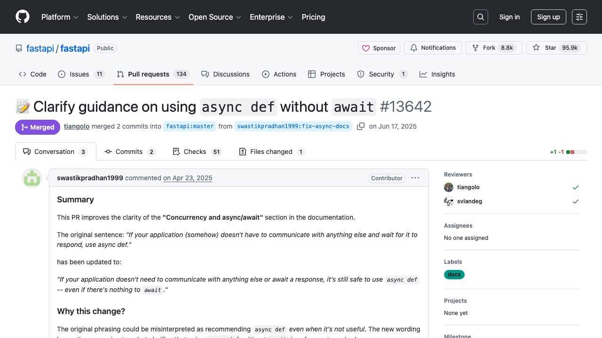
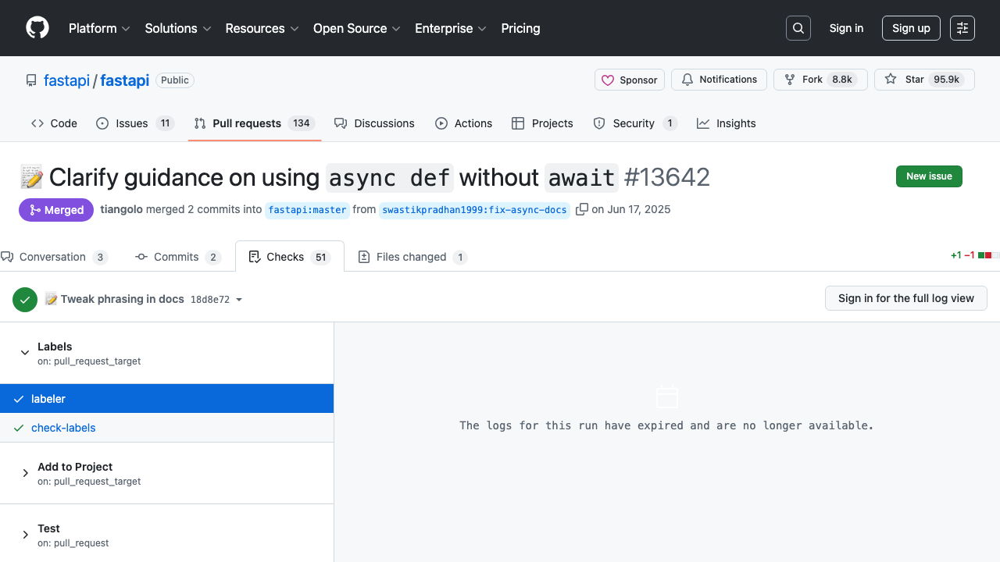

# Sample: 5539467189ce

**Status:** partial

## Collected Data

| Field | Value |
|-------|-------|
| pr_title | 📝 Clarify guidance on using `async def` without `await` |
| author | swastikpradhan1999 |
| merge_status | merged |
| approvers | svlandeg,tiangolo |
| ci_passed_count | 51 |
| ci_failed_count | 1 |
| ci_pending_count | 0 |
| linked_tickets |  |
| pr_page_screenshot | 5539467189ce__web__pr-main-page__20260305-052021__0.png |
| checks_page_screenshot | 5539467189ce__web__pr-checks-page__20260305-052031__0.png |

## Agent Walkthrough

- Navigated to [https://github.com/fastapi/fastapi/pull/13642](https://github.com/fastapi/fastapi/pull/13642)

**Taking screenshot: pr-main-page**

- Clicking element on page_0

**Taking screenshot: pr-checks-page**

- Clicking element on page_0

- Clicking element on page_0

- Navigated to [https://github.com/fastapi/fastapi/pull/13642](https://github.com/fastapi/fastapi/pull/13642)

- **Recorded `pr_title`** = 📝 Clarify guidance on using `async def` without `await`

- **Recorded `author`** = swastikpradhan1999

- **Recorded `merge_status`** = merged

- **Recorded `approvers`** = svlandeg,tiangolo

- **Recorded `ci_passed_count`** = 51

- **Recorded `ci_failed_count`** = 1

- **Recorded `ci_pending_count`** = 0

- **Recorded `linked_tickets`** = 

- **Recorded `pr_page_screenshot`** = 5539467189ce__web__pr-main-page__20260305-052021__0.png

- **Recorded `checks_page_screenshot`** = 5539467189ce__web__pr-checks-page__20260305-052031__0.png

- Closing page_0
