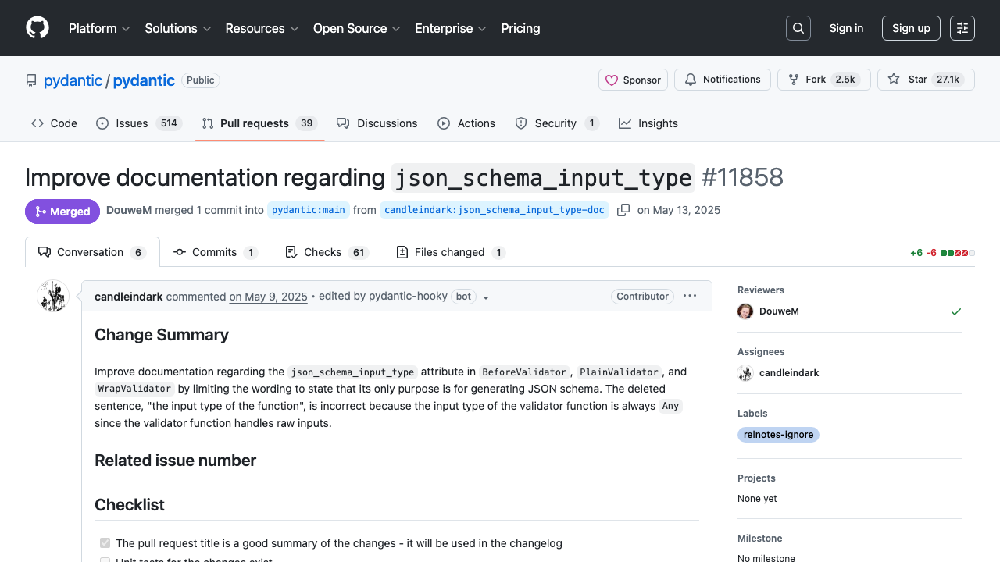
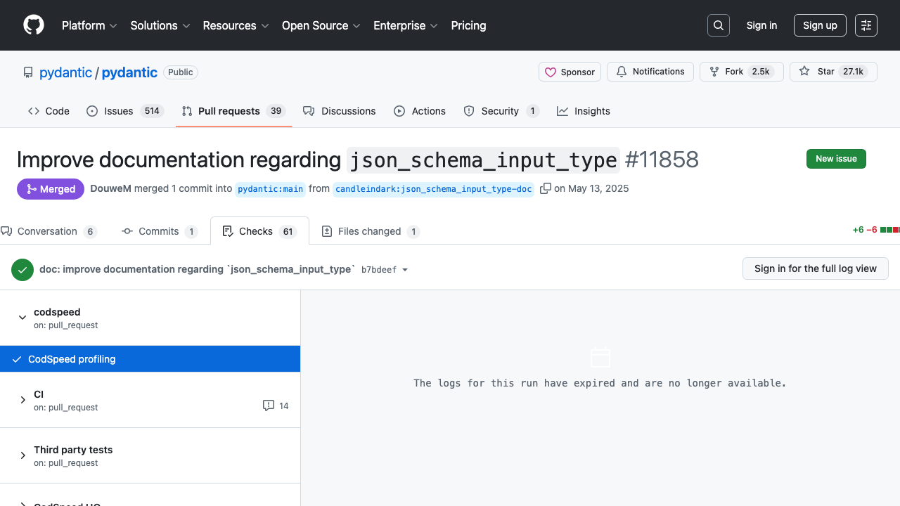
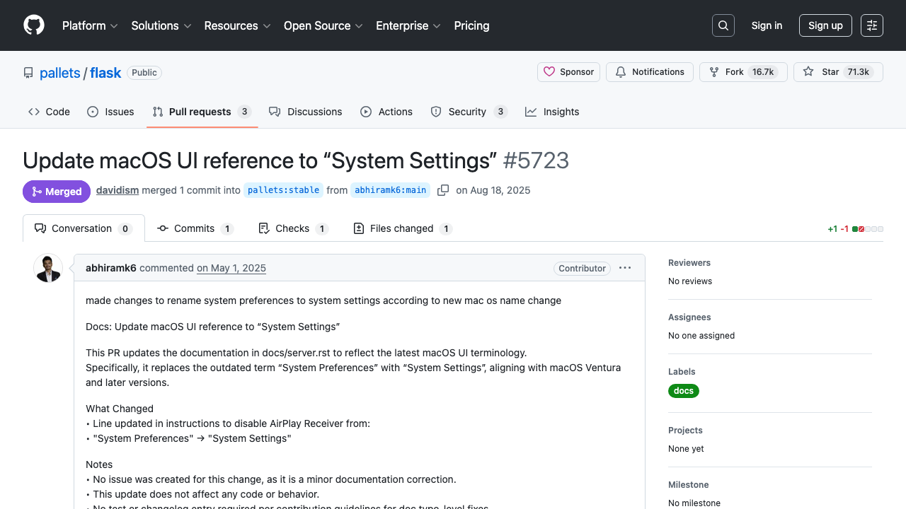
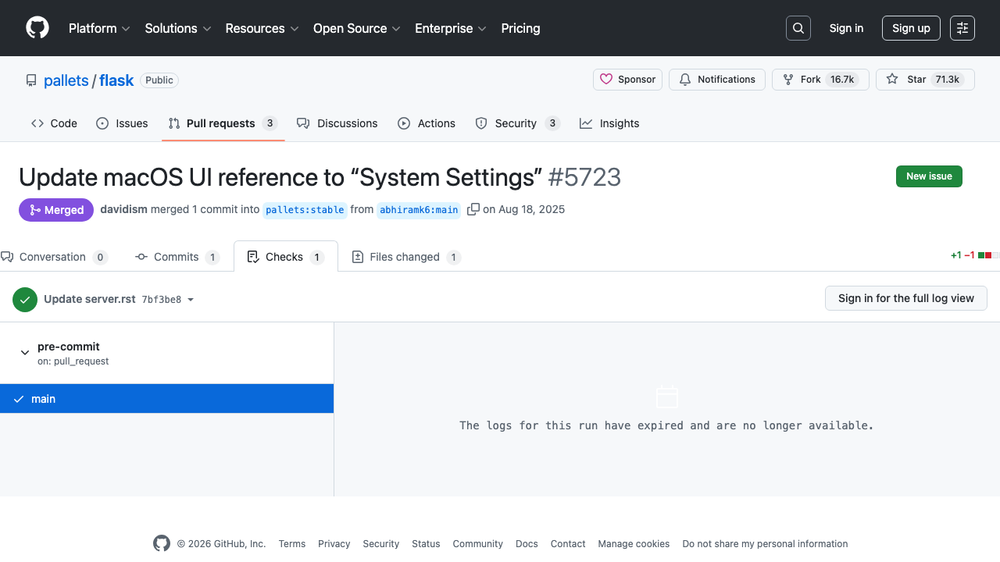

# Evidence Collection Report: github-pr-analysis

## Summary

| # | Sample | Status | Fields Collected |
|---|--------|--------|-----------------|
| 1 | 4678d0b87612 | partial | 10 |
| 2 | 5539467189ce | partial | 10 |
| 3 | c434a7011c80 | partial | 10 |

---

## 4678d0b87612

**Status:** partial

### Collected Data

| Field | Value |
|-------|-------|
| pr_title | Improve documentation regarding json_schema_input_type |
| author | candleindark |
| merge_status | merged |
| approvers | DouweM |
| ci_passed_count | 61 |
| ci_failed_count | 0 |
| ci_pending_count | 0 |
| linked_tickets |  |
| pr_page_screenshot | 4678d0b87612__web__pr-main-page__20260305-052255__0.png |
| checks_page_screenshot | 4678d0b87612__web__pr-checks-page__20260305-052302__0.png |

### Agent Actions

- Navigated to [https://github.com/pydantic/pydantic/pull/11858](https://github.com/pydantic/pydantic/pull/11858)

**Taking screenshot: pr-main-page**

- Clicking element on page_0

**Taking screenshot: pr-checks-page**

- Clicking element on page_0

- Clicking element on page_0

- **Recorded `pr_title`** = Improve documentation regarding json_schema_input_type

- **Recorded `author`** = candleindark

- **Recorded `merge_status`** = merged

- **Recorded `approvers`** = DouweM

- **Recorded `ci_passed_count`** = 61

- **Recorded `ci_failed_count`** = 0

- **Recorded `ci_pending_count`** = 0

- **Recorded `linked_tickets`** = 

- **Recorded `pr_page_screenshot`** = 4678d0b87612__web__pr-main-page__20260305-052255__0.png

- **Recorded `checks_page_screenshot`** = 4678d0b87612__web__pr-checks-page__20260305-052302__0.png

- Closing page_0

---

## 5539467189ce

**Status:** partial

### Collected Data

| Field | Value |
|-------|-------|
| pr_title | 📝 Clarify guidance on using `async def` without `await` |
| author | swastikpradhan1999 |
| merge_status | merged |
| approvers | svlandeg,tiangolo |
| ci_passed_count | 51 |
| ci_failed_count | 1 |
| ci_pending_count | 0 |
| linked_tickets |  |
| pr_page_screenshot | 5539467189ce__web__pr-main-page__20260305-052021__0.png |
| checks_page_screenshot | 5539467189ce__web__pr-checks-page__20260305-052031__0.png |

### Agent Actions

- Navigated to [https://github.com/fastapi/fastapi/pull/13642](https://github.com/fastapi/fastapi/pull/13642)

**Taking screenshot: pr-main-page**

- Clicking element on page_0

**Taking screenshot: pr-checks-page**

- Clicking element on page_0

- Clicking element on page_0

- Navigated to [https://github.com/fastapi/fastapi/pull/13642](https://github.com/fastapi/fastapi/pull/13642)

- **Recorded `pr_title`** = 📝 Clarify guidance on using `async def` without `await`

- **Recorded `author`** = swastikpradhan1999

- **Recorded `merge_status`** = merged

- **Recorded `approvers`** = svlandeg,tiangolo

- **Recorded `ci_passed_count`** = 51

- **Recorded `ci_failed_count`** = 1

- **Recorded `ci_pending_count`** = 0

- **Recorded `linked_tickets`** = 

- **Recorded `pr_page_screenshot`** = 5539467189ce__web__pr-main-page__20260305-052021__0.png

- **Recorded `checks_page_screenshot`** = 5539467189ce__web__pr-checks-page__20260305-052031__0.png

- Closing page_0

---

## c434a7011c80

**Status:** partial

### Collected Data

| Field | Value |
|-------|-------|
| pr_title | Update macOS UI reference to "System Settings" |
| author | abhiramk6 |
| merge_status | merged |
| approvers |  |
| ci_passed_count | 2 |
| ci_failed_count | 0 |
| ci_pending_count | 0 |
| linked_tickets |  |
| pr_page_screenshot | c434a7011c80__web__pr-main-page__20260305-052430__0.png |
| checks_page_screenshot | c434a7011c80__web__pr-checks-page__20260305-052439__0.png |

### Agent Actions

- Navigated to [https://github.com/pallets/flask/pull/5723](https://github.com/pallets/flask/pull/5723)

**Taking screenshot: pr-main-page**

- Clicking element on page_0

**Taking screenshot: pr-checks-page**

- Clicking element on page_0

- Navigated to [https://github.com/pallets/flask/pull/5723](https://github.com/pallets/flask/pull/5723)

- **Recorded `pr_title`** = Update macOS UI reference to "System Settings"

- **Recorded `author`** = abhiramk6

- **Recorded `merge_status`** = merged

- **Recorded `approvers`** = 

- **Recorded `ci_passed_count`** = 2

- **Recorded `ci_failed_count`** = 0

- **Recorded `ci_pending_count`** = 0

- **Recorded `linked_tickets`** = 

- **Recorded `pr_page_screenshot`** = c434a7011c80__web__pr-main-page__20260305-052430__0.png

- **Recorded `checks_page_screenshot`** = c434a7011c80__web__pr-checks-page__20260305-052439__0.png

- Closing page_0

- Closing page_1
